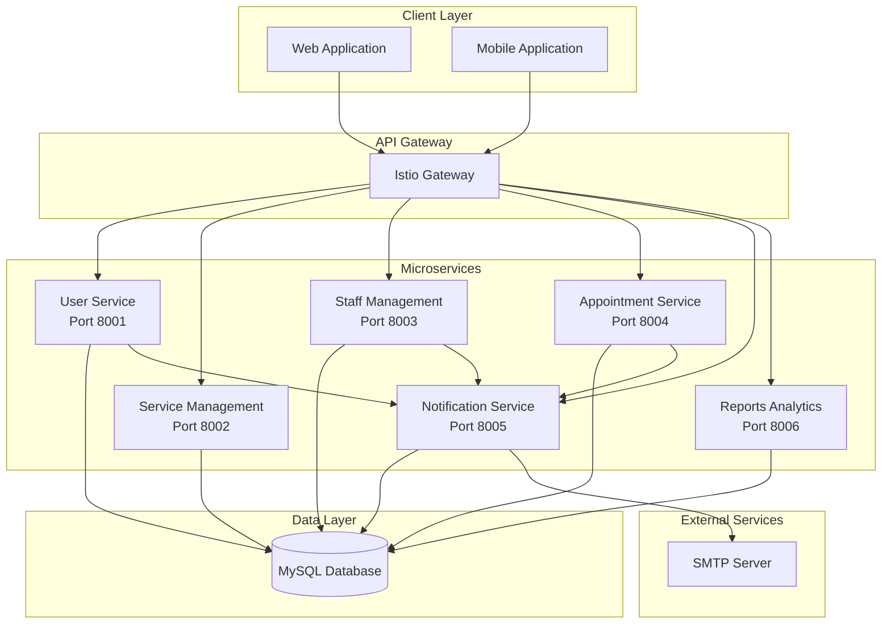
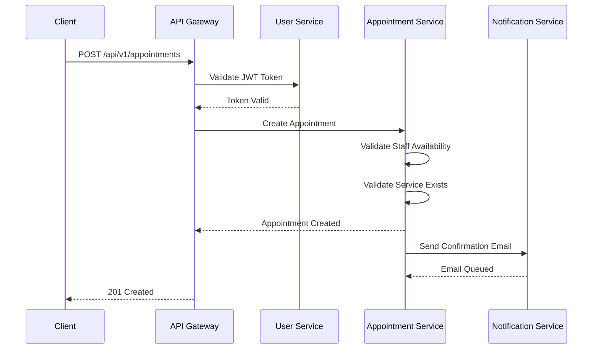
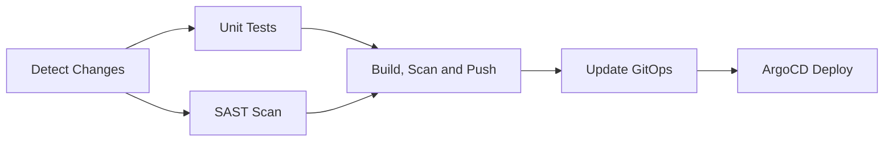
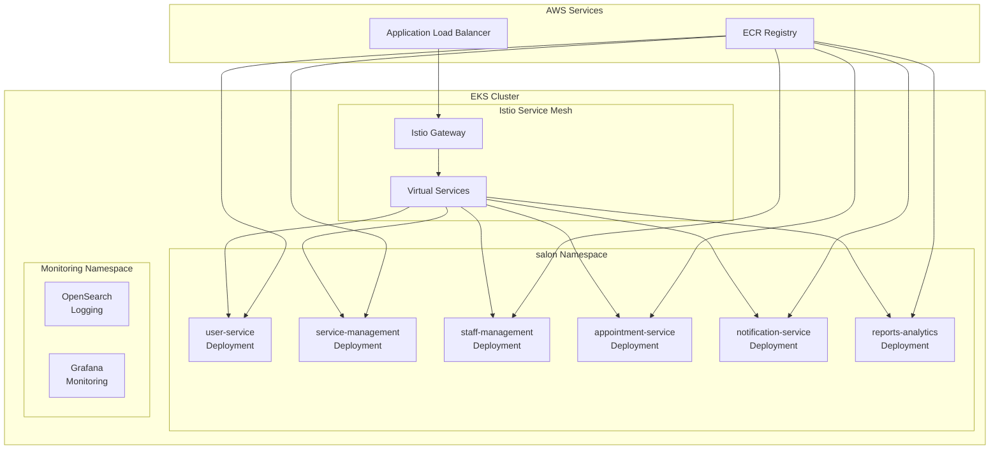
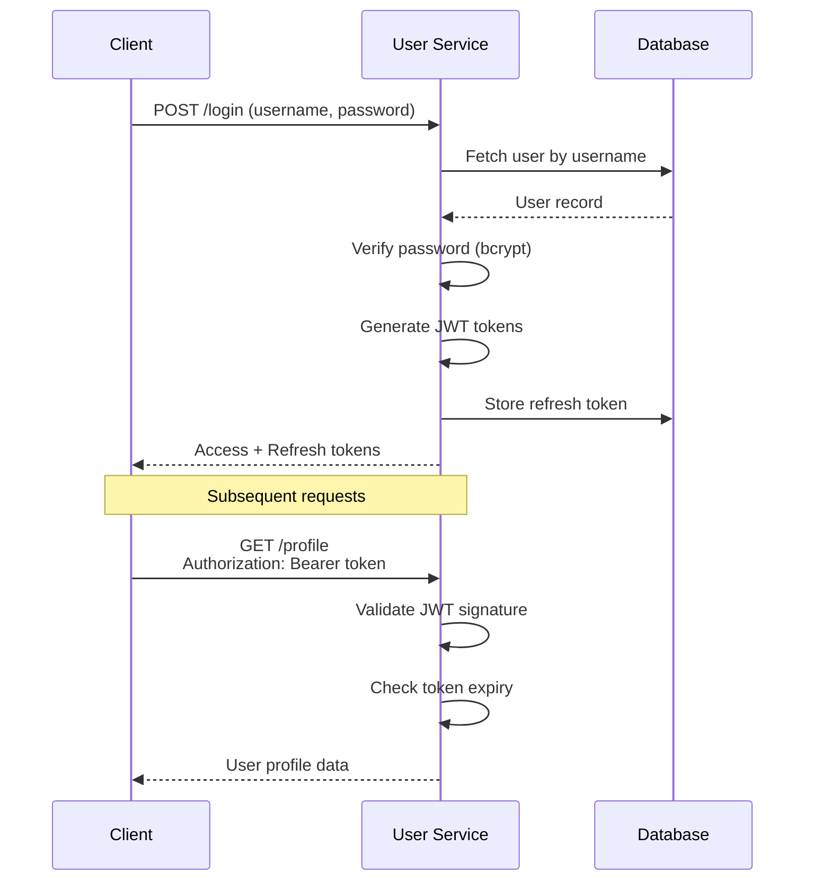

# Salon Booking System - Backend Services

A microservices architecture for salon appointment management built with Python and FastAPI.

## Table of Contents

1. [Architecture Overview](#architecture-overview)
2. [Services](#services)
3. [Technology Stack](#technology-stack)
4. [Project Structure](#project-structure)
5. [API Reference](#api-reference)
6. [Development Setup](#development-setup)
7. [Testing](#testing)
8. [CI/CD Pipeline](#cicd-pipeline)
9. [Deployment](#deployment)
10. [Security](#security)
11. [Contributing](#contributing)

---

## Architecture Overview

### System Architecture



### Service Communication Pattern



---

## Services

### User Service (Port 8001)

Handles user authentication, authorization, and profile management.

| Endpoint | Method | Description | Auth |
|----------|--------|-------------|------|
| `/api/v1/register` | POST | Register new customer account | Public |
| `/api/v1/login` | POST | Authenticate and obtain tokens | Public |
| `/api/v1/refresh` | POST | Refresh access token | Public |
| `/api/v1/logout` | POST | Invalidate refresh token | Public |
| `/api/v1/profile` | GET | Get current user profile | User |
| `/api/v1/profile` | PUT | Update user profile | User |
| `/api/v1/profile/password` | PUT | Change password | User |
| `/api/v1/users` | GET | List all users (paginated) | Admin |
| `/api/v1/users` | POST | Create user account | Admin |
| `/api/v1/health` | GET | Service health check | Public |

### Service Management (Port 8002)

Manages salon services catalog including pricing and duration.

| Endpoint | Method | Description | Auth |
|----------|--------|-------------|------|
| `/api/v1/services` | GET | List all services | User |
| `/api/v1/services` | POST | Create new service | Admin |
| `/api/v1/services/{id}` | GET | Get service details | User |
| `/api/v1/services/{id}` | PUT | Update service | Admin |
| `/api/v1/services/{id}` | DELETE | Deactivate service | Admin |
| `/api/v1/servicespub` | GET | Public services list | Public |
| `/api/v1/health` | GET | Service health check | Public |

### Staff Management (Port 8003)

Manages staff profiles, positions, and availability schedules.

| Endpoint | Method | Description | Auth |
|----------|--------|-------------|------|
| `/api/v1/staff` | GET | List all staff members | User |
| `/api/v1/staff` | POST | Create staff member | Admin |
| `/api/v1/staff/{id}` | GET | Get staff details | User |
| `/api/v1/staff/{id}` | PUT | Update staff profile | Admin |
| `/api/v1/staff/{id}` | DELETE | Deactivate staff member | Admin |
| `/api/v1/staff/{id}/availability` | GET | Get staff availability | User |
| `/api/v1/staff/{id}/availability` | POST | Set availability slots | Admin |
| `/api/v1/health` | GET | Service health check | Public |

### Appointment Service (Port 8004)

Core booking engine handling appointment lifecycle.

| Endpoint | Method | Description | Auth |
|----------|--------|-------------|------|
| `/api/v1/appointments` | GET | List all appointments | Admin |
| `/api/v1/appointments` | POST | Create new appointment | User |
| `/api/v1/appointments/{id}` | GET | Get appointment details | User |
| `/api/v1/appointments/{id}` | PUT | Update appointment | User |
| `/api/v1/appointments/{id}` | DELETE | Cancel appointment | User |
| `/api/v1/users/{id}/appointments` | GET | Get user appointments | User |
| `/api/v1/staff/{id}/appointments` | GET | Get staff appointments | User |
| `/api/v1/appointments/date/{date}` | GET | Get appointments by date | User |
| `/api/v1/health` | GET | Service health check | Public |

### Notification Service (Port 8005)

Handles email notifications for system events.

| Endpoint | Method | Description | Auth |
|----------|--------|-------------|------|
| `/api/v1/notifications/email/register-user` | POST | Welcome email | Internal |
| `/api/v1/notifications/email/reset-password` | POST | Password reset email | Internal |
| `/api/v1/notifications/email/create-staff` | POST | Staff welcome email | Admin |
| `/api/v1/notifications/email/create-appointment` | POST | Booking confirmation | User |
| `/api/v1/notifications/email/update-appointment` | POST | Booking update notice | User |
| `/api/v1/notifications/email/cancel-appointment` | POST | Cancellation notice | User |
| `/api/v1/health` | GET | Service health check | Public |

### Reports and Analytics (Port 8006)

Business intelligence and reporting dashboard data.

| Endpoint | Method | Description | Auth |
|----------|--------|-------------|------|
| `/api/v1/analytics/revenue/summary` | GET | Revenue overview | Admin |
| `/api/v1/analytics/revenue/daily` | GET | Daily revenue breakdown | Admin |
| `/api/v1/analytics/revenue/monthly` | GET | Monthly revenue trends | Admin |
| `/api/v1/analytics/revenue/by-service` | GET | Revenue by service | Admin |
| `/api/v1/analytics/revenue/by-staff` | GET | Revenue by staff | Admin |
| `/api/v1/analytics/services/popular` | GET | Popular services | Admin |
| `/api/v1/analytics/staff/performance` | GET | Staff performance metrics | Admin |
| `/api/v1/analytics/appointments/summary` | GET | Appointment statistics | Admin |
| `/api/v1/analytics/customers/top` | GET | Top customers | Admin |
| `/api/v1/analytics/dashboard` | GET | Dashboard data | Admin |
| `/api/v1/health` | GET | Service health check | Public |

---

## Technology Stack

### Core Technologies

| Component | Technology | Version |
|-----------|------------|---------|
| Language | Python | 3.12 |
| Framework | FastAPI | Latest |
| Database | MySQL | 8.0 |
| ORM | MySQL Connector | Latest |
| Authentication | JWT (PyJWT) | Latest |
| Password Hashing | bcrypt | Latest |
| Validation | Pydantic | v2 |
| HTTP Client | httpx | Latest |

### Infrastructure

| Component | Technology |
|-----------|------------|
| Container Runtime | Docker |
| Container Orchestration | Kubernetes (AWS EKS) |
| Service Mesh | Istio |
| Container Registry | AWS ECR |
| CI/CD | GitHub Actions |
| GitOps | ArgoCD |
| Monitoring | OpenSearch, Grafana |

### Testing and Security

| Component | Technology |
|-----------|------------|
| Unit Testing | pytest |
| API Testing | httpx / TestClient |
| SAST | Bandit |
| Container Scanning | Trivy |
| Code Coverage | pytest-cov |

---

## Project Structure

```
salon-booking-backend-dev/
├── .github/
│   └── workflows/
│       ├── ci-cd-pipeline.yml      # Main CI/CD workflow
│       └── dependency-scan.yml     # Dependency vulnerability scan
├── docs/
│   ├── CI_CD_PIPELINE.md           # Pipeline documentation
│   ├── HEALTH_CHECK.md             # Health check specifications
│   └── SECURITY.md                 # Security guidelines
├── user_service/
│   ├── app/
│   │   ├── __init__.py
│   │   ├── auth.py                 # JWT and password utilities
│   │   ├── config.py               # Environment configuration
│   │   ├── database.py             # Database connection manager
│   │   ├── dependencies.py         # FastAPI dependencies
│   │   ├── routes.py               # API endpoints
│   │   ├── schemas.py              # Pydantic models
│   │   └── services.py             # Business logic
│   ├── tests/
│   │   ├── conftest.py             # Test fixtures
│   │   └── test_api.py             # API tests
│   ├── Dockerfile
│   ├── main.py                     # Application entry point
│   ├── pytest.ini                  # Pytest configuration
│   └── requirements.txt
├── appointment_service/            # Same structure as user_service
├── staff_management/               # Same structure as user_service
├── service_management/             # Same structure as user_service
├── notification_service/           # Same structure as user_service
├── reports_analytics/              # Same structure as user_service
├── .trivyignore                    # Trivy vulnerability exceptions
├── .trivy.yaml                     # Trivy configuration
└── README.md
```

---

## API Reference

### Authentication

All protected endpoints require a valid JWT token in the Authorization header:

```
Authorization: Bearer <access_token>
```

### Token Types

| Token | Expiry | Purpose |
|-------|--------|---------|
| Access Token | 15 minutes | API authentication |
| Refresh Token | 7 days | Obtain new access tokens |

### Standard Response Formats

**Success Response:**

```json
{
  "status": "success",
  "data": { },
  "message": "Operation completed successfully"
}
```

**Error Response:**

```json
{
  "status": "error",
  "error_code": "VALIDATION_ERROR",
  "message": "Validation failed",
  "details": {
    "field": "email",
    "message": "Invalid email format"
  }
}
```

### Pagination

Paginated endpoints accept the following query parameters:

| Parameter | Type | Default | Max | Description |
|-----------|------|---------|-----|-------------|
| page | integer | 1 | - | Page number |
| limit | integer | 10 | 100 | Items per page |

**Paginated Response:**

```json
{
  "data": [ ],
  "pagination": {
    "page": 1,
    "limit": 10,
    "total": 100,
    "pages": 10
  }
}
```

---

## Development Setup

### Prerequisites

- Python 3.12 or higher
- MySQL 8.0 or higher
- Docker and Docker Compose (optional)
- Git

### Local Development

1. **Clone the repository:**

```bash
git clone https://github.com/WSO2-G02/salon-booking-backend-dev.git
cd salon-booking-backend-dev
```

2. **Create virtual environment:**

```bash
python -m venv venv
source venv/bin/activate  # Linux/macOS
# or
.\venv\Scripts\activate   # Windows
```

3. **Install dependencies:**

```bash
cd user_service
pip install -r requirements.txt
```

4. **Configure environment variables:**

Create a `.env` file in each service directory:

```bash
# Database Configuration
DB_HOST=localhost
DB_PORT=3306
DB_NAME=user_db
DB_USER=salon_user
DB_PASSWORD=your_password

# JWT Configuration
JWT_SECRET_KEY=your-secret-key-min-32-chars
JWT_ALGORITHM=HS256
ACCESS_TOKEN_EXPIRE_MINUTES=15
REFRESH_TOKEN_EXPIRE_DAYS=7

# CORS Configuration
ALLOWED_ORIGINS=http://localhost:3000

# Service Configuration
SERVICE_NAME=user_service
SERVICE_PORT=8001

# Inter-service Communication
NOTIFICATION_SERVICE_URL=http://localhost:8005
```

5. **Start the service:**

```bash
uvicorn main:app --host 0.0.0.0 --port 8001 --reload
```

6. **Access API documentation:**

- Swagger UI: http://localhost:8001/docs
- ReDoc: http://localhost:8001/redoc

---

## Testing

### Running Tests

```bash
# Run all tests
pytest

# Run with coverage
pytest --cov=app --cov-report=html

# Run specific test file
pytest tests/test_api.py

# Run with verbose output
pytest -v
```

### Test Structure

```
tests/
├── conftest.py          # Shared fixtures
├── test_api.py          # API endpoint tests
├── test_services.py     # Business logic tests
└── test_auth.py         # Authentication tests
```

### Coverage Requirements

| Metric | Threshold |
|--------|-----------|
| Line Coverage | 70% minimum |
| Branch Coverage | 60% minimum |

---

## CI/CD Pipeline

### Pipeline Stages



### Stage Details

| Stage | Tool | Purpose |
|-------|------|---------|
| Detect Changes | Git Diff | Identify modified services |
| Unit Tests | pytest | Verify functionality |
| SAST Scan | Bandit | Python security analysis |
| Build | Docker | Container image creation |
| Vulnerability Scan | Trivy | Container CVE detection |
| Push | AWS ECR | Registry upload |
| GitOps Update | Git | Deployment manifest update |

### Triggers

| Event | Branch | Action |
|-------|--------|--------|
| Push | main | Full pipeline |
| Pull Request | main | Tests and scans only |
| Manual | main | Selective service build |

### Configuration Files

| File | Purpose |
|------|---------|
| `.github/workflows/ci-cd-pipeline.yml` | Main workflow |
| `.trivyignore` | Vulnerability exceptions |
| `.trivy.yaml` | Scanner configuration |

For detailed pipeline documentation, see [docs/CI_CD_PIPELINE.md](docs/CI_CD_PIPELINE.md).

---

## Deployment

### Kubernetes Architecture



---

## Security

### Authentication Flow



### Vulnerability Management

- SAST scanning with Bandit on every commit
- Container scanning with Trivy before deployment
- Dependency scanning with GitHub Dependabot
- CVE exceptions documented in `.trivyignore`

For detailed security guidelines see [docs/SECURITY.md](docs/SECURITY.md).

