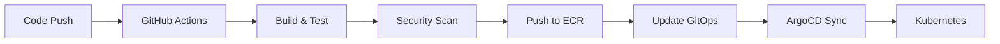
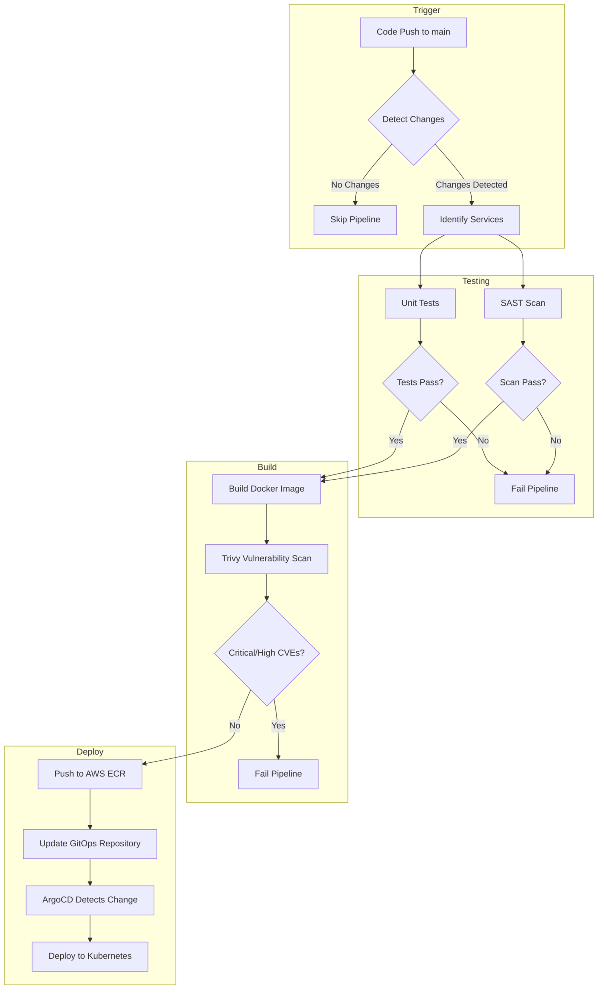
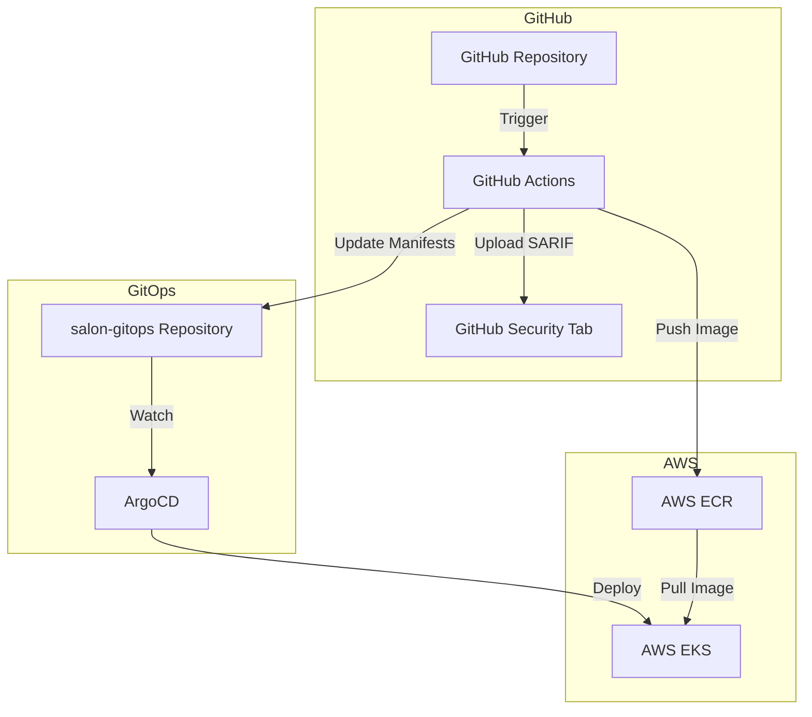
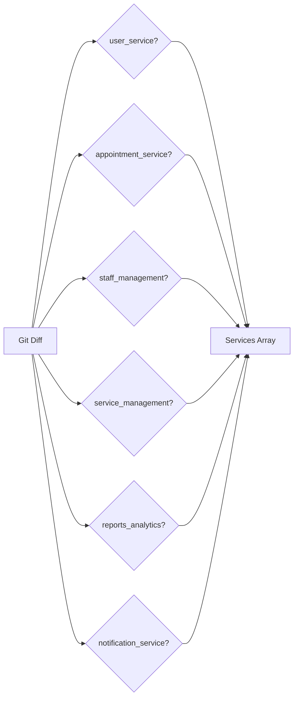
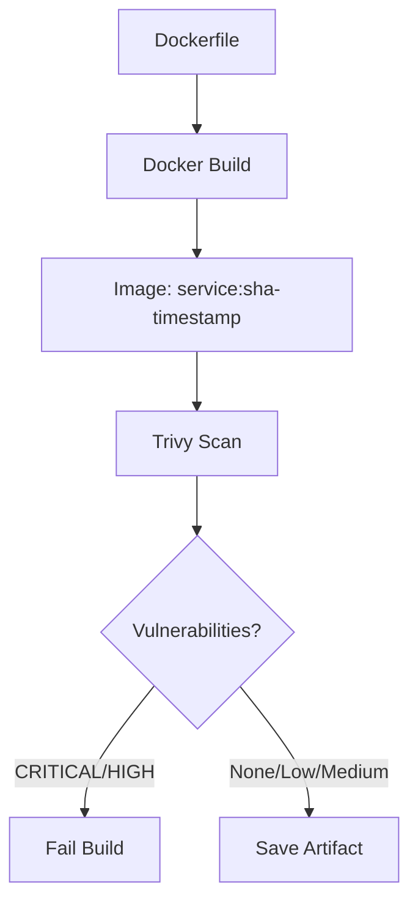
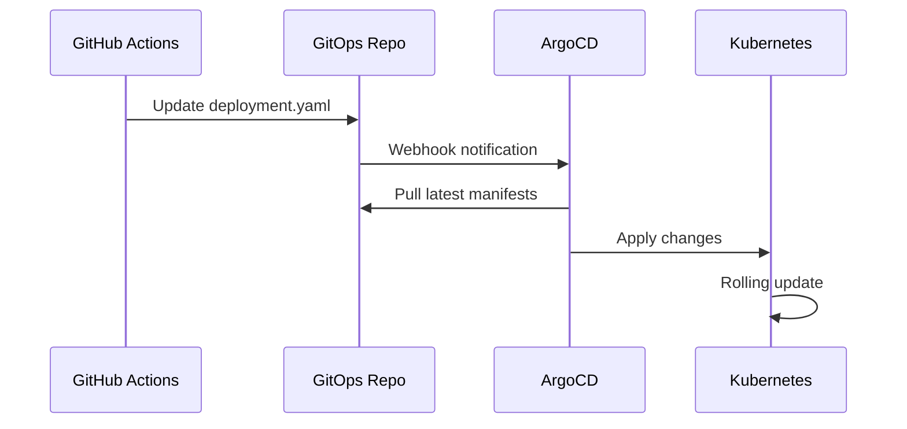

# CI/CD Pipeline Documentation

## Table of Contents

1. [Overview](#overview)
2. [Pipeline Architecture](#pipeline-architecture)
3. [Pipeline Stages](#pipeline-stages)
4. [Workflow Files](#workflow-files)
5. [Configuration](#configuration)
6. [Troubleshooting](#troubleshooting)

---

## Overview

This document describes the Continuous Integration and Continuous Deployment (CI/CD) pipeline for the Salon Booking Backend microservices. The pipeline automates the process of testing, scanning, building, and deploying containerized applications to AWS EKS via GitOps methodology.

### Key Features

- Automated change detection for selective service builds
- Unit testing with pytest
- Static Application Security Testing (SAST) with Bandit
- Container vulnerability scanning with Trivy
- Automated image push to AWS ECR
- GitOps-based deployment via ArgoCD

---

## Pipeline Architecture

### High-Level Flow



### Detailed Pipeline Flow



### Component Interaction



---

## Pipeline Stages

### Stage 1: Detect Changes

**Purpose**: Identify which microservices have been modified to avoid unnecessary builds.

**Process**:
1. Compare current commit with previous commit using `git diff`
2. Check if changes exist in any service directory
3. Output list of affected services for downstream jobs

**Trigger Conditions**:
- Push to `main` branch
- Pull request to `main` branch
- Manual workflow dispatch



### Stage 2: Unit Tests

**Purpose**: Validate application logic and ensure code quality.

**Tools**:
- pytest: Test framework
- pytest-asyncio: Async test support
- pytest-cov: Code coverage reporting

**Process**:
1. Set up Python 3.12 environment
2. Install service dependencies from `requirements.txt`
3. Execute tests from `tests/` directory
4. Generate JUnit XML report for GitHub Actions

**Test Coverage**:
- Health endpoint validation
- Root endpoint response verification
- OpenAPI documentation availability
- API response format validation

### Stage 3: SAST Scan

**Purpose**: Identify security vulnerabilities in source code before deployment.

**Tool**: Bandit (Python Security Linter)

**Process**:
1. Install Bandit security scanner
2. Analyze Python source code in `app/` directory
3. Generate JSON report for artifact storage
4. Report findings (non-blocking)

**Vulnerability Categories Detected**:
- SQL injection risks
- Command injection vulnerabilities
- Hardcoded secrets
- Insecure cryptographic usage
- XML vulnerabilities

### Stage 4: Build and Scan

**Purpose**: Create container images and scan for vulnerabilities.

**Tools**:
- Docker Buildx: Multi-platform image building
- Trivy: Container vulnerability scanner

**Process**:
1. Build Docker image using service Dockerfile
2. Tag image with commit SHA and timestamp
3. Run Trivy scanner in SARIF format
4. Upload results to GitHub Security tab
5. Run blocking scan for CRITICAL/HIGH vulnerabilities
6. Save image artifact for push stage

**Image Tagging Convention**:
```
{ecr-registry}/{service-name}:{short-sha}-{timestamp}
{ecr-registry}/{service-name}:latest
```



### Stage 5: Push to ECR

**Purpose**: Store validated container images in AWS Elastic Container Registry.

**Process**:
1. Configure AWS credentials
2. Authenticate with ECR
3. Load saved image artifact
4. Push tagged image to ECR
5. Push latest tag to ECR

**Prerequisites**:
- AWS_ACCESS_KEY_ID secret configured
- AWS_SECRET_ACCESS_KEY secret configured
- ECR repository exists for service

### Stage 6: Update GitOps

**Purpose**: Update deployment manifests to trigger ArgoCD synchronization.

**Process**:
1. Clone salon-gitops repository
2. Parse list of updated services
3. Update image tag in `staging/{service}/deployment.yaml`
4. Commit and push changes

**GitOps Repository Structure**:
```
salon-gitops/
  staging/
    user_service/
      deployment.yaml    <-- Image tag updated here
      service.yaml
      hpa.yaml
    appointment_service/
      ...
```



---

## Workflow Files

### ci-cd-pipeline.yml

Main CI/CD workflow containing all pipeline stages.

| Job | Description | Depends On |
|-----|-------------|------------|
| detect-changes | Identify modified services | - |
| unit-tests | Run pytest | detect-changes |
| sast-scan | Run Bandit | detect-changes |
| build-scan | Build and Trivy scan | unit-tests, sast-scan |
| push-to-ecr | Push to AWS ECR | build-scan |
| update-gitops | Update deployment manifests | push-to-ecr |
| pipeline-summary | Generate summary report | all |

### dependency-scan.yml

Weekly dependency vulnerability scanning.

| Job | Description | Schedule |
|-----|-------------|----------|
| dependency-scan | pip-audit on requirements.txt | Mondays 06:00 UTC |
| trivy-filesystem | Trivy filesystem scan | Mondays 06:00 UTC |

---

## Configuration

### Required GitHub Secrets

| Secret | Description | Required For |
|--------|-------------|--------------|
| AWS_ACCESS_KEY_ID | AWS IAM access key | ECR push |
| AWS_SECRET_ACCESS_KEY | AWS IAM secret key | ECR push |
| GITOPS_TOKEN | GitHub PAT with repo scope | GitOps update |

### Environment Variables

| Variable | Value | Description |
|----------|-------|-------------|
| AWS_REGION | eu-north-1 | AWS region for ECR |
| ECR_REGISTRY | 024955634588.dkr.ecr.eu-north-1.amazonaws.com | ECR registry URL |
| PYTHON_VERSION | 3.12 | Python version for tests |

### Service Configuration

Each service requires:

```
{service}/
  Dockerfile          # Container build instructions
  requirements.txt    # Python dependencies (includes pytest)
  pytest.ini          # pytest configuration
  tests/
    conftest.py       # Test fixtures
    test_api.py       # API tests
  app/
    ...               # Application code
```

---

## Troubleshooting

### Common Issues

#### Pipeline fails at Unit Tests

**Symptoms**: Tests fail with import errors

**Solution**:
1. Verify all dependencies are in `requirements.txt`
2. Check that `conftest.py` correctly imports the FastAPI app
3. Ensure database mocking is configured if tests require DB

#### Trivy scan blocks deployment

**Symptoms**: Build fails with CRITICAL or HIGH vulnerabilities

**Solution**:
1. Check GitHub Security tab for vulnerability details
2. Update base image to latest version
3. Update vulnerable dependencies
4. If false positive, add to `.trivyignore`

#### GitOps update fails

**Symptoms**: GITOPS_TOKEN authentication error

**Solution**:
1. Verify PAT has `repo` scope
2. Check PAT is not expired
3. Ensure PAT owner has write access to salon-gitops

#### ECR push fails

**Symptoms**: AWS authentication error

**Solution**:
1. Verify AWS_ACCESS_KEY_ID is correct
2. Verify AWS_SECRET_ACCESS_KEY is correct
3. Check IAM user has ECR push permissions
4. Verify ECR repository exists

### Viewing Logs

1. Navigate to GitHub Actions tab
2. Select the failed workflow run
3. Expand the failed job
4. Review step-by-step logs


