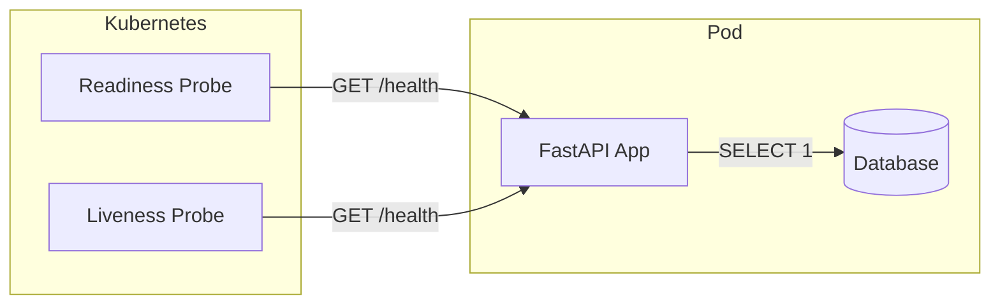
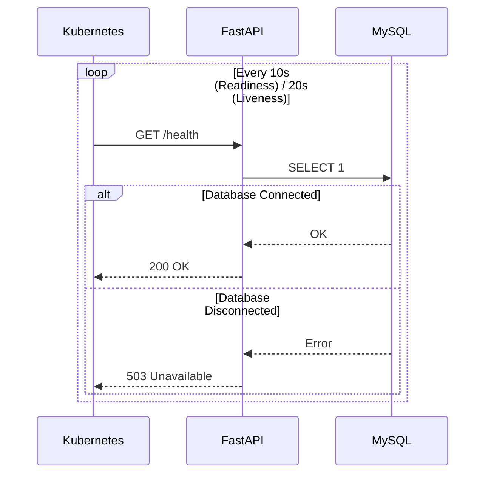
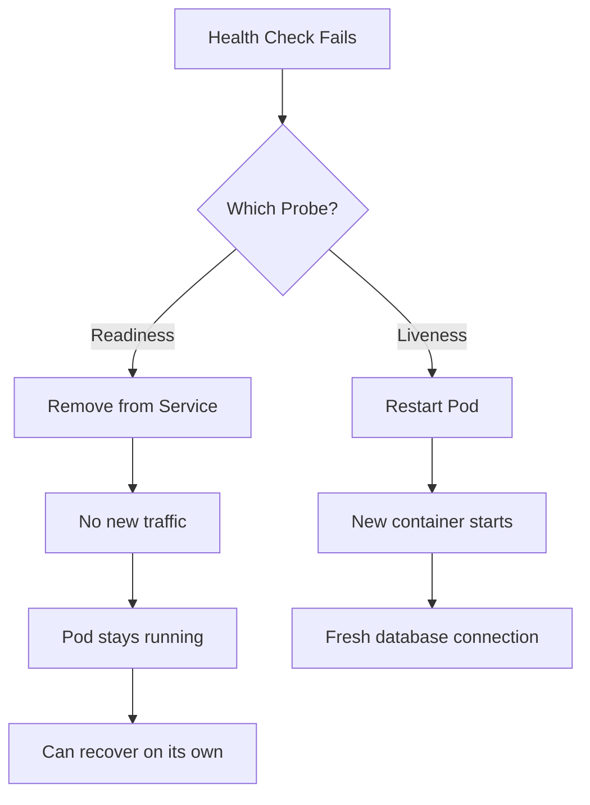

# Health Check Endpoint

## Table of Contents

1. [Overview](#overview)
2. [Endpoint Specification](#endpoint-specification)
3. [Response Format](#response-format)
4. [Kubernetes Integration](#kubernetes-integration)
5. [Architecture](#architecture)

---

## Overview

All microservices expose a `/health` endpoint for Kubernetes health monitoring. This endpoint verifies application and database connectivity, enabling automatic traffic management and pod recovery.

---

## Endpoint Specification

| Property | Value |
|----------|-------|
| Path | `/health` |
| Method | `GET` |
| Authentication | None |
| Response Type | `application/json` |

### HTTP Status Codes

| Code | Status | Description |
|------|--------|-------------|
| 200 | OK | Service healthy, database connected |
| 503 | Service Unavailable | Service unhealthy, database disconnected |

---

## Response Format

### Healthy Response (200 OK)

```json
{
  "service": "user_service",
  "status": "healthy",
  "checks": {
    "database": "connected"
  }
}
```

### Unhealthy Response (503 Service Unavailable)

```json
{
  "service": "user_service",
  "status": "unhealthy",
  "checks": {
    "database": "disconnected"
  }
}
```

---

## Kubernetes Integration

The health endpoint is used by two Kubernetes probes:



### Readiness Probe

Determines if the pod should receive traffic.

| Parameter | Value | Description |
|-----------|-------|-------------|
| initialDelaySeconds | 5 | Wait before first check |
| periodSeconds | 10 | Check interval |
| failureThreshold | 3 | Failures before removal |

**Behavior:** Pod removed from Service after 3 consecutive failures (30s).

### Liveness Probe

Determines if the pod should be restarted.

| Parameter | Value | Description |
|-----------|-------|-------------|
| initialDelaySeconds | 15 | Wait before first check |
| periodSeconds | 20 | Check interval |
| failureThreshold | 3 | Failures before restart |

**Behavior:** Pod restarted after 3 consecutive failures (60s).

---

## Architecture

### Health Check Flow



### Automatic Recovery Flow



---

## Service Ports

| Service | Port |
|---------|------|
| user_service | 8001 |
| service_management | 8002 |
| staff_management | 8003 |
| appointment_service | 8004 |
| notification_service | 8005 |
| reports_analytics | 8006 |
