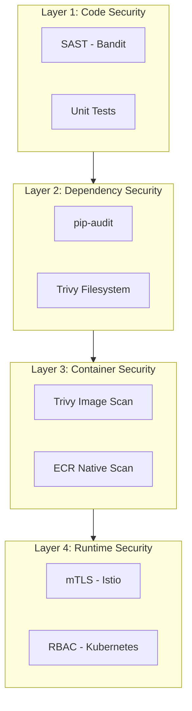
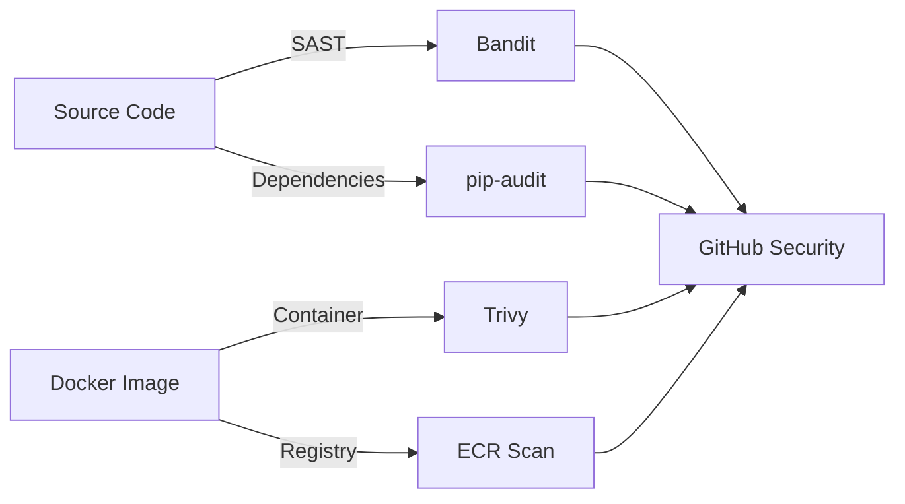
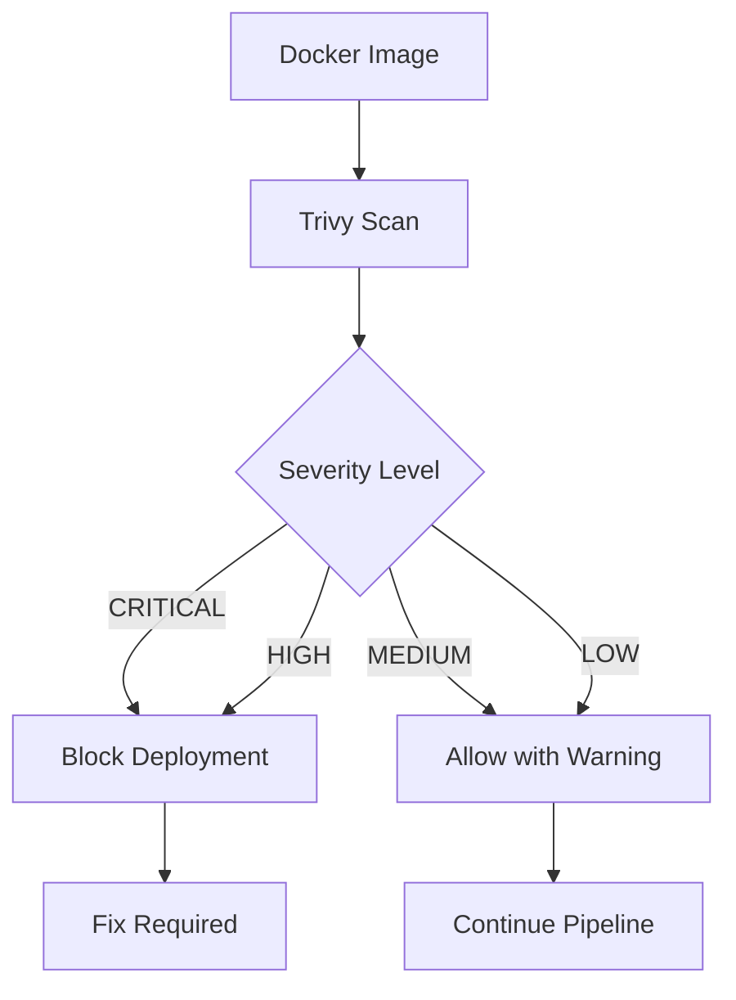
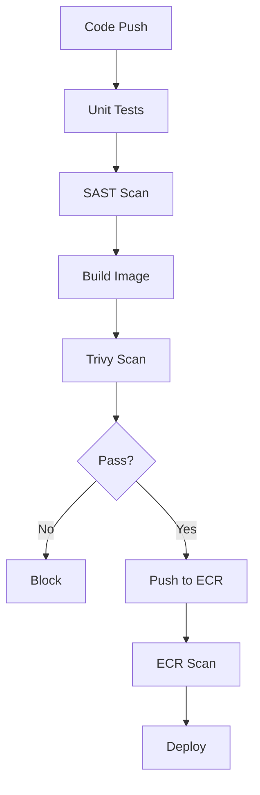
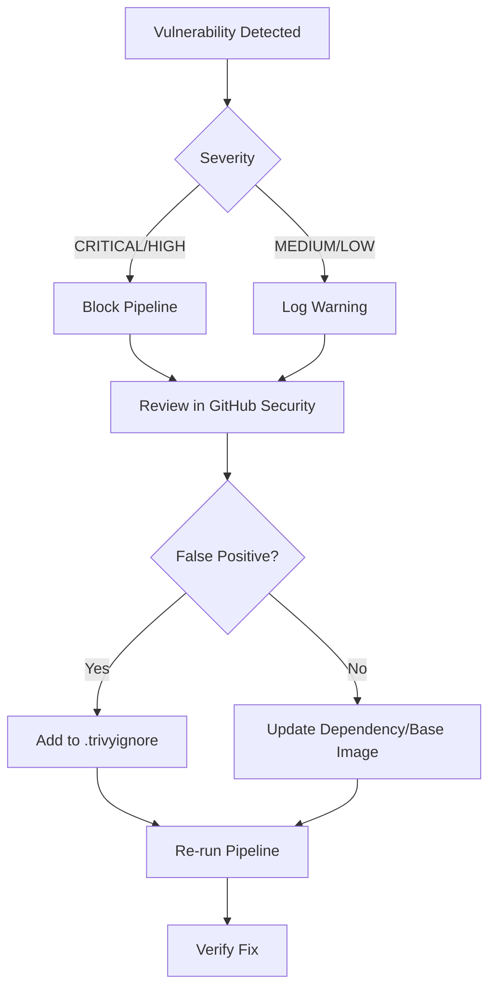

# Security Policy

## Table of Contents

1. [Overview](#overview)
2. [Security Architecture](#security-architecture)
3. [Security Scanning](#security-scanning)
4. [Pipeline Integration](#pipeline-integration)
5. [Configuration](#configuration)
6. [Vulnerability Management](#vulnerability-management)

---

## Overview

This document defines the security policies, scanning procedures, and vulnerability management practices for the Salon Booking Backend microservices.

---

## Security Architecture

### Defense in Depth

### Security Scanning Flow

---

## Security Scanning

### Static Application Security Testing (SAST)

| Property | Value |
|----------|-------|
| Tool | Bandit |
| Trigger | Every push and pull request |
| Scope | Python source code in `app/` directories |
| Blocking | No (reports only) |
| Output | JSON report uploaded as artifact |

**Vulnerabilities Detected**:
- SQL injection patterns
- Command injection risks
- Hardcoded passwords and secrets
- Insecure cryptographic usage
- XML external entity (XXE) vulnerabilities

### Container Image Scanning

| Property | Value |
|----------|-------|
| Tool | Trivy |
| Trigger | On push to main, on pull requests |
| Severity Levels | CRITICAL, HIGH |
| Blocking | Yes |
| Output | SARIF report to GitHub Security tab |

### Dependency Scanning

| Property | Value |
|----------|-------|
| Tool | pip-audit, Trivy filesystem |
| Trigger | requirements.txt changes, weekly schedule |
| Schedule | Mondays at 06:00 UTC |
| Coverage | All 6 microservices |

### AWS ECR Scanning

| Property | Value |
|----------|-------|
| Tool | AWS ECR native scanning |
| Trigger | Automatic on image push |
| Configuration | `scan_on_push = true` in Terraform |

---

## Pipeline Integration

### CI/CD Security Gates

### Pipeline Stages

| Stage | Description | Tool | Blocking |
|-------|-------------|------|----------|
| Unit Tests | Validate application logic | pytest | Yes |
| SAST Scan | Static code security analysis | Bandit | No |
| Build Image | Create Docker container | Docker Buildx | Yes |
| Trivy Scan | Container vulnerability scan | Trivy | Yes |
| Push to ECR | Store in container registry | AWS ECR | Yes |
| ECR Scan | Additional container scan | AWS ECR | No |
| Deploy | Update Kubernetes | ArgoCD | Yes |

---

## Configuration

### Required GitHub Secrets

| Secret Name | Description | Used By |
|-------------|-------------|---------|
| AWS_ACCESS_KEY_ID | AWS access key | ECR authentication |
| AWS_SECRET_ACCESS_KEY | AWS secret key | ECR authentication |
| GITOPS_TOKEN | GitHub PAT | GitOps repository updates |

### AWS Configuration

| Property | Value |
|----------|-------|
| ECR Registry | `<AWS_ACCOUNT_ID>.dkr.ecr.<AWS_REGION>.amazonaws.com` |
| Region | `<AWS_REGION>` |
| Scan on Push | Enabled |

> **Note:** Set `<AWS_ACCOUNT_ID>` and `<AWS_REGION>` AWS account ID and region as repository secrets or environment variables.

### Protected Services

| Service | ECR Repository |
|---------|---------------|
| user_service | user_service |
| appointment_service | appointment_service |
| staff_management | staff_management |
| service_management | service_management |
| reports_analytics | reports_analytics |
| notification_service | notification_service |

---

## Vulnerability Management

### Severity Classification

| Severity | Response Time | Action Required |
|----------|--------------|-----------------|
| CRITICAL | Immediate | Block deployment, fix required |
| HIGH | 24 hours | Block deployment, fix required |
| MEDIUM | 7 days | Warning, fix recommended |
| LOW | 30 days | Informational, fix optional |

### Remediation Process

### Reporting

Security scan results are available in:
1. **GitHub Security Tab** - SARIF reports from Trivy
2. **Workflow Artifacts** - Bandit JSON reports
3. **Workflow Summary** - Pipeline status overview

---

## Workflow Files

| File | Purpose |
|------|---------|
| `ci-cd-pipeline.yml` | Main CI/CD pipeline with security gates |
| `dependency-scan.yml` | Weekly dependency vulnerability scanning |
| `.trivy.yaml` | Trivy scanner configuration |
